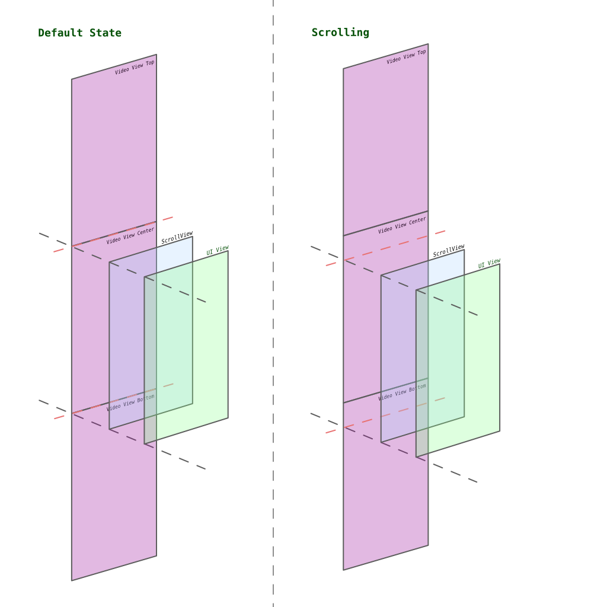

# 多频道滑动切换的方案

多频道滑动切换的方案

2023.01.28 Hu Yuhua Created

## 主要思路

使用三个自定义的VideoView来显示视频（中间的 **主View**）和封面图片（屏幕外两侧的 **副View**）  
在滚动结束后重排三个VideoView的位置，造成无缝切换的感受  
只使用三个View可以有效减少资源消耗，复用的情况下也可以减少View载入和重绘的消耗  
将按钮等UI部分剥离成一个最上层的View，在滚动时隐藏，在滚动停止时根据当前显示频道更新其中内容再显示出来，减少UI的销毁和初始化消耗

## 流程

### 进入直播间时初始状态

中央显示出的 **主View** 加入频道，并订阅视频和音频
显示区域外的另两个 **副View**（副View1和副View2）不加入频道，只显示对应频道的封面图片

### 滚动中

显示出的另一个 **副View** 在显示区域达到某个高度之后开始加入频道，显示视频，但不订阅音频
> 参见示意图的Scrolling部分，Video View Bottom此时进入视野范围，会开始加入频道并显示视频。




在该 **副View** 的显示范围到达一半之后将原 **主View** 的音频订阅取消，改为订阅 **副View**  中的频道的音频。

### 滚动停止时

只有中央显示出的 **主View** 在频道中，订阅视频和音频。
将滑出上下1个View高度范围的 **副View** 移动到另一侧，保持显示的 **主View** 在三个View列表的中间，便于下次滑动
显示区域外的两个 **副View**（副View1和副View2）退出频道，显示对应频道的封面图片

**至此一次滑动切换完成**

## 伪代码

```Swift
var viewA: VideoView
var viewB: VideoView
var viewC: VideoView

var ViewList = [ViewA, ViewB, ViewC]

var ChannelList = [channel01, channel02, channel03, ..., channel10]

ViewA.channel = ChannelList[9]
ViewA.showChannelCoverImage()

ViewB.channel = ChannelList[0]
viewB.joinChannel()
ViewB.showVideo()
ViewB.unmuteAudio()

ViewC.channel = ChannelList[9]
ViewC.showChannelCoverImage()

func onScrolling(scrollView: ScrollView) {
	if scrollView.offset > 32 {
		viewC.joinChannel()
		ViewC.showVideo()
		ViewC.muteAudio()
	}
	
	if scrollView.offset > screenHeight/2 {
		ViewB.muteAudio()
		ViewC.unmuteAudio()
	}
}

func onScrollStop(scrollView: ScrollView) {
	if ViewC is display in center {
		[ViewA, ViewB, ViewC] -> [ViewB, ViewC, ViewA]
	}
	ViewB.leaveChannel()
	ViewB.showChannelCoverImage()

	ViewA.channel = ChannelList[2]
	ViewA.showChannelCoverImage()
}

```

## 状态说明（状态机）

### 00 初始状态

| View   | Channel   | JoinChannel | Video | Audio | Image |
| ------ | --------- | ----------- | ----- | ----- | ----- |
| View A | channel10 | N           | N     | N     | Y     |
| View B | channel01 | Y           | Y     | Y     | N     |
| View C | channel02 | N           | N     | N     | Y     |
|        | channel03 |             |       |       |       |
|        | channel04 |             |       |       |       |
|        | channel05 |             |       |       |       |
|        | channel06 |             |       |       |       |
|        | channel07 |             |       |       |       |
|        | channel08 |             |       |       |       |
|        | channel09 |             |       |       |       |

### 01 向上滚动到ViewC 显示出 32px

| View   | Channel   | JoinChannel | Video | Audio | Image |
| ------ | --------- | ----------- | ----- | ----- | ----- |
| View A | channel10 | N           | N     | N     | Y     |
| View B | channel01 | Y           | Y     | Y     | N     |
| View C | channel02 | Y           | Y     | N     | N     |
|        | channel03 |             |       |       |       |
|        | channel04 |             |       |       |       |
|        | channel05 |             |       |       |       |
|        | channel06 |             |       |       |       |
|        | channel07 |             |       |       |       |
|        | channel08 |             |       |       |       |
|        | channel09 |             |       |       |       |

### 02 向上滚动到ViewC 显示出一半屏幕高度

| View   | Channel   | JoinChannel | Video | Audio | Image |
| ------ | --------- | ----------- | ----- | ----- | ----- |
| View A | channel10 | N           | N     | N     | Y     |
| View B | channel01 | Y           | Y     | N     | N     |
| View C | channel02 | Y           | Y     | Y     | N     |
|        | channel03 |             |       |       |       |
|        | channel04 |             |       |       |       |
|        | channel05 |             |       |       |       |
|        | channel06 |             |       |       |       |
|        | channel07 |             |       |       |       |
|        | channel08 |             |       |       |       |
|        | channel09 |             |       |       |       |

### 03 ViewC到达屏幕中间，滚动停止

| View   | Channel   | JoinChannel | Video | Audio | Image |
| ------ | --------- | ----------- | ----- | ----- | ----- |
|        | channel10 |             |       |       |       |
| View B | channel01 | N           | N     | N     | Y     |
| View C | channel02 | Y           | Y     | Y     | N     |
| View A | channel03 | N           | N     | N     | Y      |
|        | channel04 |             |       |       |       |
|        | channel05 |             |       |       |       |
|        | channel06 |             |       |       |       |
|        | channel07 |             |       |       |       |
|        | channel08 |             |       |       |       |
|        | channel09 |             |       |       |       |

## 几个可能还可以优化的点

ViewA的移动时机可能可以提前到 02，以一半屏幕高度作为分界点来处理
> 这个问题在于如果用户手指不离开屏幕继续往回滚动会造成ViewList的顺序变化过多，可能会有获取View错误的风险

封面图片可以在获取ChannelList之后即开始在后台缓存

## iOS的Demo代码

[AgoraMultiChannelSwitch_iOS on Github](https://github.com/DarkEggStudio/AgoraMultiChannelSwitch_iOS)

-- END --
